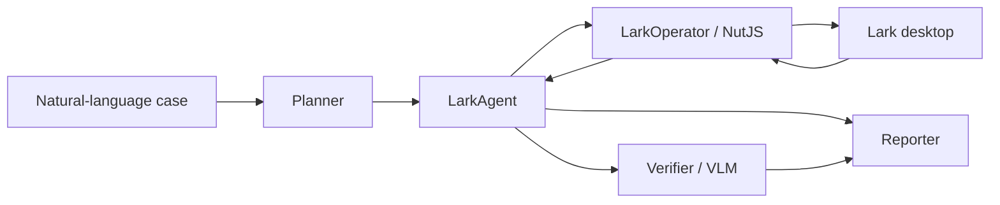

# CUA-Lark System Design

## Architecture

## Modules

- Planner converts standard cases or ad hoc instructions into executable objectives.
- LarkAgent owns the execution loop, retries, timeout boundaries, and event capture.
- LarkOperator wraps `@ui-tars/operator-nut-js` with Lark focus, screenshot archival, and action audit events.
- PopupGuard adds prompt-level handling for update prompts, permission prompts, and loading stalls.
- Verifier sends the final screenshot and success criteria to an OpenAI-compatible VLM endpoint.
- Reporter writes structured JSON plus Markdown and HTML summaries for evaluation.

## Data Flow

1. CLI loads `.env` and `cua.config.json`.
2. Built-in cases are materialized with timestamp, test chat, attendee, and tomorrow 14:00.
3. Planner creates objectives.
4. LarkAgent focuses Lark and runs UI-TARS against each objective.
5. LarkOperator captures screenshots and delegates actions to NutJS.
6. Verifier checks final visual state against the success criteria.
7. Reporter aggregates status, duration, screenshots, model calls, and failure reasons.

## Technology Choices

- TypeScript provides a clear CLI and typed report schemas.
- UI-TARS SDK gives the screenshot -> VLM -> action -> operator loop without depending on Agent TARS CLI.
- NutJS provides cross-platform mouse, keyboard, scroll, and screenshot primitives.
- OpenAI-compatible VLM config supports Volcengine Ark and other providers with the same interface.

## Safety Boundaries

- No login, CAPTCHA, or protected-content bypass automation.
- No real credentials in repo files.
- Test data is timestamped and should target disposable chats, docs, and calendar events.
- Real runs require explicit removal of `--dry-run`.
